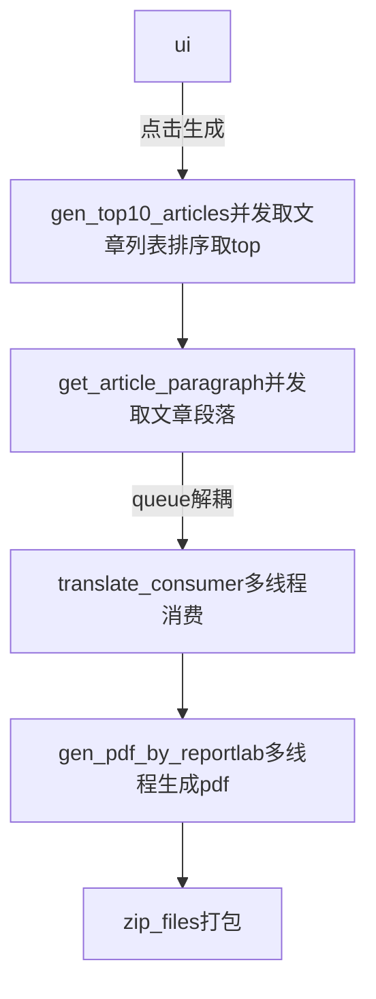

# 2024Game
基本功能都做了一遍，因为浏览器版本兼容和效率，并未使用chromedriver这种方式，想着前期将流程打通，后面再做优化和算法去优化。受限于网络和免费服务，不然可以加入语音合成功能，整个在线文章语音播报，翻译让NLP模型来做，让懒的人更懒，哈哈哈，努力不就是为了懒么，人类的进步就是因为懒，所以才去创造噶。   


## 目前完成情况
1. 爬取medium网页信息(分析其后端接口，模拟请求获取数据，再解析数据)，rank，top10
2. 获取文章段落和标题（同上）
3. 翻译-百度API（限制多，考虑到模型推理性能、成本、网络、幻觉和指令遵循约束问题，还是API快一点）
4. 生成pdf，目前没把图片搞进去，其实也简单
5. 打zip包
6. 界面展示下载
7. 并发和优化

## 说下问题
1. medium网页目前取了100页的top10，后续要找到更快的方式，适当使用算法提升性能。
2. 翻译API需要换掉
3. pdf目前没把图片搞进去，其实也简单

## 流程


## Quickstart
环境：python 3.10  

操作

安装依赖

```
pip install reportlab gradio zipfile
```

运行

```
python ui.py
```

## 效果
注意，翻译api 替换为 自己的id和密钥。


