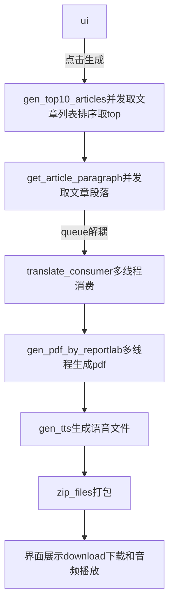
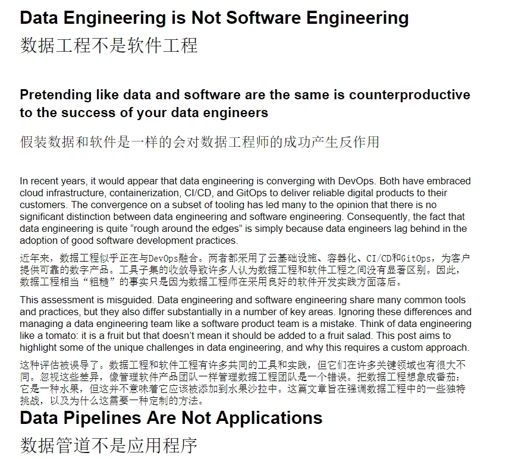
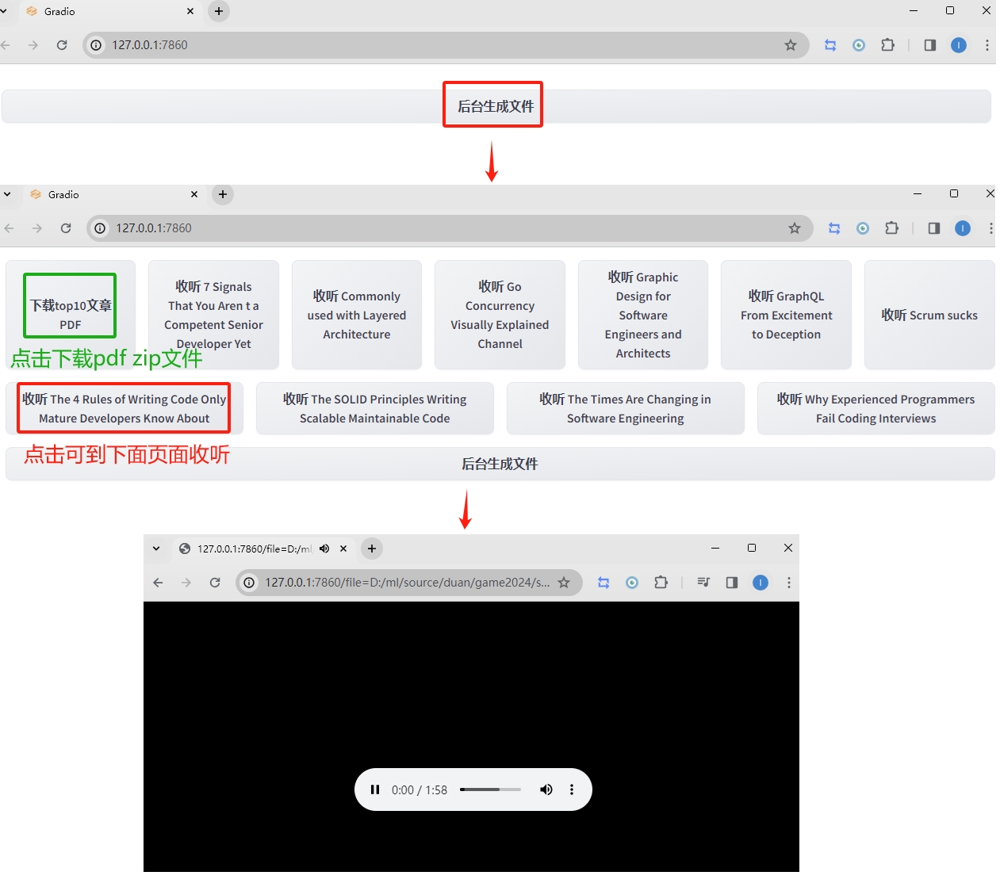

# 2024Game
基本功能都做了一遍，因为浏览器版本兼容和效率，并未使用chromedriver这种方式，想着前期将流程打通，后面再做优化和算法去优化。受限于网络和免费服务，不然可以加入语音合成功能，整个在线文章语音播报，翻译让NLP模型来做，让懒的人更懒，哈哈哈，努力不就是为了懒么，人类的进步就是因为懒，所以才去创造噶。   

## 思路
1. 抓取文章内容：
Medium的https://medium.com/_/graphql接口 并发抓取文章内容列表。然后根据clapCount排序，获取top10. 在并发去获取这10个文章的内容并解析，形成用于翻译的数据列表。

2. 使用翻译服务翻译内容：
考虑使用一些在线翻译服务的 API，百度翻译 API，tps较低，后续考虑本地量化模型来提供服务。

3. 将翻译后的内容保存成 PDF 文件：
使用reportlab，并发的将翻译后的内容，以及标题排版后 写入 PDF 文件。fpdf、docx2pdf都有点坑~

4. 生成语音文件：
使用智能模型为每个文章生成语音文件，可以在线播放，也可以下载，让用户在眼睛忙的时候，可以用耳朵听。

5. 打包成 ZIP 文件：
使用 zipfile将生成的 PDF 文件打包成一个 ZIP 文件。

6. 界面集成
使用gradio构建简单界面，多线程交互的时候gradio、webbrowser和streamlit都试过，花了好些时间。


## 目前完成情况
1. 爬取medium网页信息(分析其后端接口，模拟请求获取数据，再解析数据)，rank，top10
2. 获取文章段落和标题（同上）
3. 翻译-百度API（限制多，考虑到模型推理性能、成本、网络、幻觉和指令遵循约束问题，还是API快一点）
4. 生成pdf，目前没把图片搞进去，其实也简单
5. 为文章生成音频文件
6. 打zip包
7. 界面展示下载
8. 并发和优化

## 说下问题
1. medium网页目前取了100页的top10，后续要找到更快的方式，适当使用算法提升性能。
2. 翻译API需要换掉
3. pdf目前没把图片搞进去，其实也简单，就是懒

## 流程


## Quickstart
环境：python 3.10  

操作

安装依赖

```
pip install reportlab gradio zipfile
```

运行

```
python ui.py
```

## 效果
注意，翻译api 替换为 自己的id和密钥。
### pdf生成效果


### UI

