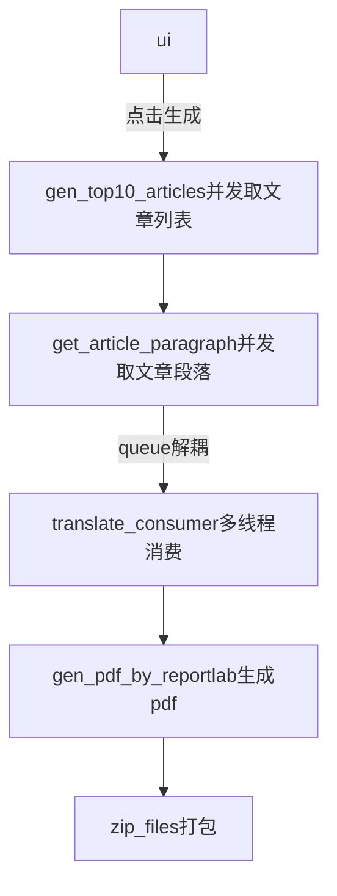

# 2024Game
tfbGame2024
基本功能都做了一遍，想着前期将流程打通，后面再做优化和算法去优化。
## 目前完成情况
1. 爬取medium网页信息(分析其后端接口，模拟请求获取数据，再解析数据)
2. 获取文章段落和标题（同上）
3. 翻译-百度API（限制多）
4. 生成pdf，目前没把图片搞进去，其实也简单
5. 打zip包
6. 界面展示下载
7. 并发和优化

## 说下问题
1. 加了并发，并未完全测试
2. medium网页目前取了100页的top10，后续要找到更快的方式，适当使用算法提升性能。
3. 翻译API需要换掉
4. pdf目前没把图片搞进去，其实也简单

## 流程


## Quickstart

操作

安装依赖

```
pip install reportlab streamlit zipfile
```

运行

```
streamlit run ui.py
```
